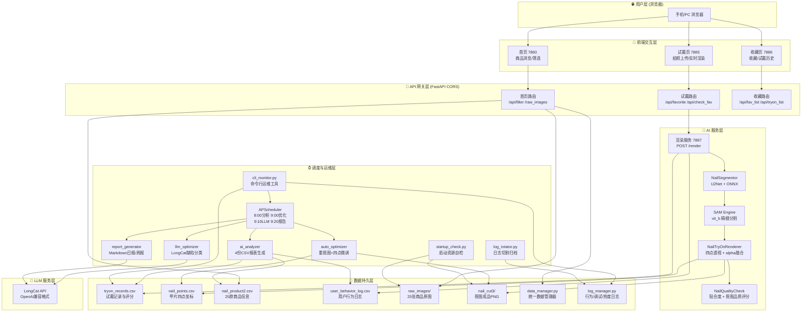

# nail-ai-tryon-platform

# NAIL AI — AI美甲智能试戴与运营平台

> **前后端一体化 · AI驱动 · 全链路自动化 · 云端部署**

NAIL AI 是一个基于深度学习和计算机视觉的美甲智能试戴与运营平台。用户上传手部照片即可实时预览美甲效果，系统内置 U2Net+SAM 高精度抠图引擎、四点透视变换贴合算法、自动质量评分与缺陷筛查、AI 自动化修复优化以及大模型（LongCat）驱动的运营日报/周报系统。后端采用 FastAPI 微服务架构，5个独立进程协同工作，配合 APScheduler 定时调度实现全链路自动化闭环。配备 CLI 运维工具与日志切割归档，可直接上线生产环境。

---

## 目录

- [技术栈](#技术栈)
- [系统架构](#系统架构)
- [核心功能模块](#核心功能模块)
- [目录结构](#目录结构)
- [快速开始](#快速开始)
- [运行部署](#运行部署)
- [设计方案要点](#设计方案要点)
- [项目亮点](#项目亮点)

---

## 技术栈

### 前端

| 技术 | 用途 |
|------|------|
| HTML5 + CSS3 | 页面结构与玻璃质感UI |
| Vanilla JavaScript (ES6) | 所有交互逻辑（零框架依赖） |
| SVG 内联图标 | 取代外部CDN，零网络请求 |
| CSS Glassmorphism | 透明玻璃质感设计语言 |

### 后端

| 技术 | 用途 |
|------|------|
| Python 3.12 | 主开发语言 |
| FastAPI + Uvicorn | 微服务框架（4个独立服务） |
| APScheduler | 定时任务调度 |
| LongCat API (OpenAI 兼容) | 大模型运营分析 |

### AI / CV

| 技术 | 用途 |
|------|------|
| U2Net (ONNX) | 全图指甲区域粗分割 |
| SAM (Segment Anything, vit_b) | 单指甲精细分割 |
| MediaPipe Hands | 指尖关键点检测与排序 |
| OpenCV + NumPy | 图像处理、透视变换、质量评分 |
| OpenCV minAreaRect | 甲片旋转矫正与四点定位 |

### 运维

| 技术 | 用途 |
|------|------|
| SSH + Plink | 云端部署与远程管理 |
| gzip 日志归档 | 自动日志切割与清理 |
| CLI 监控工具 | 服务状态/配置管理/一键运维 |

### 可选

| 技术 | 用途 |
|------|------|
| Docker | 容器化部署 |
| Nginx | 反向代理与负载均衡 |
| CUDA / cuDNN | GPU 加速推理 |

---

## 系统架构



### 端口与服务映射

| 端口 | 服务 | 进程文件 | 职责 |
|------|------|----------|------|
| **7860** | 首页服务 | `nail_home_server.py` | 商品浏览、多维筛选、商品卡片展示 |
| **7885** | 试戴服务 | `nail_tryon_server.py` | 手部拍照、试戴渲染、收藏操作 |
| **7886** | 收藏记录 | `nail_fav_page.py` | 收藏列表、试戴历史查询 |
| **7887** | 渲染API | `nail_render_server.py` | AI渲染核心接口（仅POST） |
| — | 调度器 | `report_scheduler.py` | APScheduler 后台定时任务 |

### 定时调度时间线

```
08:00  AI分析     → ai_analyzer  → 4份报表(热度/画像/劣质/建议)
09:00  自动优化   → auto_optimizer → 重抠图 + 四点微调
09:10  LLM精细优化 → llm_optimizer  → LongCat缺陷分类 + 参数建议
09:20  运营报告   → report_generator → Markdown日报(周一+周报)
       日志归档   → log_rotator  → gzip压缩 + 清理30天前
```

---

## 核心功能模块

### 1. 前端交互系统（3个用户界面）

- **首页 (7860)**：25款商品以2列网格展示；多维度筛选（场合/款式/颜色/长度/甲型）；标签切换带筛选功能；底部玻璃导航栏跳转试戴与收藏。
- **试戴页 (7885)**：手部照片上传/拍照；实时调用渲染API；渲染结果即时显示（base64）；收藏/分享/查看记录；收藏粒子动效与toast提示。
- **收藏页 (7886)**：收藏商品列表；试戴历史记录（含缩略图）；TAB切换；加载动画与空状态提示。

**设计语言**：玻璃质感（Glassmorphism）全栈统一——按钮使用 `rgba` + `backdrop-filter: blur()`实现透明玻璃效果，卡片微悬停抬升动效，图片加载淡入动画。

### 2. 后端微服务体系

- **4个独立FastAPI进程**：端口隔离、互不干扰、独立启停
- **CORS全开放**：跨端口AJAX调用无阻塞
- **统一资源挂载**：`raw_images` / `nail_cut3` / `tryon_results` 静态目录
- **请求日志**：所有操作经 `log_manager.py` 记录到CSV

### 3. AI抠图与渲染管线

```
手部照片 → MediaPipe手部检测 → U2Net全图分割 → 连通域提取
   → SAM box prompt精修每个指甲 → MediaPipe指尖排序(0-4)
   → minAreaRect旋转矫正 → 留白裁剪 → 四点定位
   → 保存RGBA透明PNG到 nail_cut3/ → 写入 nail_points.csv
```

- **U2Net (ONNX)**：512×512全图推理，输出二值掩码
- **SAM (vit_b)**：对每个指甲检测框做box prompt推理，与U2Net掩码OR融合
- **MediaPipe Hands**：landmark 4/8/12/16/20 指尖排序
- **四点透视变换**：`order_points` 统一四点顺序（后缘左→后缘右→指尖右→指尖左）→ `cv2.getPerspectiveTransform` + `cv2.warpPerspective` → alpha通道融合

### 4. 自动质检与优化引擎

- **贴合度评分** (`get_fit_score`)：用户指甲四点 vs 产品甲片四点 → 偏差归一化 → 0~100分
- **抠图品质评分** (`get_quality_score`)：alpha覆盖率 + 边缘圆润度 + 凹凸缺陷 + 噪点检测
- **坏甲片筛查**：quality<60 或 fit<55 → 自动标记问题类型 → 生成优化建议
- **自动修复**（类型A）：U2Net+SAM重跑抠图管线 → 覆盖旧PNG → 更新四点坐标
- **四点微调**（类型B）：按比例外扩nail_points坐标 → 提高覆盖率 → 小步迭代

### 5. LLM智能运营

- **缺陷分类**：读取劣质清单 → 调用LongCat（OpenAI格式）→ 输出 `defect_category` / `adjust_param` / `risk_tag`
- **运营日报**：整合全量数据（热度排行/劣质清单/优化记录）→ LLM润色 → 输出可落地的运营建议
- **故障降级**：LLM不可用时自动降级为规则模式或纯数据表格，服务不中断

### 6. 运维监控系统

| 模块 | 功能 |
|------|------|
| **startup_check.py** | 启动时自动检查7项资源状态，缺失仅警告不崩溃 |
| **log_rotator.py** | 按天gzip归档日志，自动清理30天前数据 |
| **cli_monitor.py** | 命令行运维工具：服务状态/优化日志/坏甲片/配置修改 |
| **config.json** | 统一配置中心：所有阈值、开关、LLM参数集中管理 |
| **auto_backup** | 每次修改文件前自动备份到 `assets/backup/` |

---

## 目录结构

```
nail_project/
│
├── cli_monitor.py              ← 命令行运维工具
├── requirements.txt            ← Python 依赖
│
├── core/                       ← 核心业务逻辑层
│   ├── nail_segmentor.py       │   指甲分割引擎 (U2Net + ONNX)
│   ├── nail_cut3.py           │   U2Net+SAM 抠图管线
│   ├── nail_renderer.py       │   试戴渲染引擎 (四点透视变换)
│   ├── nail_quality_check.py  │   试戴质量评分
│   ├── ai_analyzer.py         │   数据分析 (4份CSV报表)
│   ├── auto_optimizer.py      │   自动优化引擎
│   ├── llm_optimizer.py       │   LLM缺陷分类 (LongCat)
│   ├── report_generator.py    │   运营日报/周报 (LLM润色)
│   ├── startup_check.py       │   启动资源自检
│   ├── log_rotator.py         │   日志自动切割归档
│   └── ...
│
├── services/                   ← 对外服务层 (5个进程)
│   ├── nail_home_server.py    │   [7860] 首页FastAPI
│   ├── nail_tryon_server.py   │   [7885] 试戴页FastAPI
│   ├── nail_fav_page.py       │   [7886] 收藏记录页
│   ├── nail_render_server.py  │   [7887] 渲染API
│   └── report_scheduler.py    │   APScheduler调度器
│
├── database/                   ← 运行时数据 + 配置
│   ├── config.json            │   统一配置中心
│   ├── tryon_records.csv      │   试戴历史记录
│   ├── auto_optimize_log.csv  │   自动优化日志
│   ├── llm_fix_suggest.csv    │   LLM优化建议
│   ├── ai_reports/            │   4份分析报表
│   └── tryon_records_manager.py│ CSV读写管理器
│
├── nail_database/              ← 数据库层
│   ├── data_manager.py        │   统一数据管理器
│   ├── log_manager.py         │   日志管理器
│   ├── nail_product2.csv      │   25款商品信息
│   └── ...
│
├── assets/                     ← 静态资产
│   ├── raw_images/            │   25张商品原图 (webp)
│   ├── nail_cut3/             │   抠图成品PNG + 四点坐标
│   ├── cut_nail_png/          │   旧版抠图 (备用)
│   ├── nail_product2/         │   预览缩略图
│   └── backup/                │   自动备份
│
├── report/                     ← 运营报告输出
│   └── daily_*.md             │   每日Markdown报告
│
├── logs/                       ← 日志 + 归档
│
├── deploy/                     ← 部署脚本
│   ├── deploy.ps1             │   PowerShell部署
│   ├── deploy.sh              │   Linux重启脚本
│   └── plink.exe              │   SSH客户端
│
├── dataset/                    ← U2Net训练数据集 (650张标注掩码)
├── checkpoints/                ← 模型权重 (SAM/U2Net ONNX)
│
└── model.py / train_nail_unet.py / export_onnx.py   ← 旧训练/推理脚本
```

---

## 快速开始

### 环境要求

- Python ≥ 3.10（推荐 3.12）
- 操作系统：Windows / Linux / macOS
- 磁盘空间：≥ 2GB（含模型权重）
- 内存：≥ 4GB（推荐 8GB）
- GPU（可选）：CUDA 兼容 GPU 加速 SAM 推理

### 1. 克隆项目

```bash
git clone https://github.com/your-org/nail_project.git
cd nail_project
```

### 2. 安装依赖

```bash
pip install -r requirements.txt
```

安装 SAM 模型权重（约 358MB）：

```bash
# Linux / macOS
wget -P checkpoints/ https://dl.fbaipublicfiles.com/segment_anything/sam_vit_b_01ec64.pth

# Windows 手动下载后放入 checkpoints/ 目录
# 下载地址: https://dl.fbaipublicfiles.com/segment_anything/sam_vit_b_01ec64.pth
```

安装 U2Net ONNX 模型（约 45MB）：

```bash
# 将 U2Net ONNX 导出或下载后放入 checkpoints/
# 也可直接运行 export_onnx.py 从训练ckpt导出
python export_onnx.py
```

### 3. 运行抠图管线（首次：从 raw_images 生成 nail_cut3）

```bash
python core/nail_cut3.py
```

### 4. 启动所有服务

**方式一：一键启动（Linux）**

```bash
chmod +x deploy/deploy.sh
./deploy/deploy.sh
```

**方式二：手动逐个启动（开发调试）**

```bash
# 终端1 首页服务 (7860)
python services/nail_home_server.py

# 终端2 试戴服务 (7885)
python services/nail_tryon_server.py

# 终端3 收藏记录 (7886)
python services/nail_fav_page.py

# 终端4 渲染引擎 (7887，需要较长时间加载模型)
python services/nail_render_server.py

# 终端5 定时调度器（可选）
python services/report_scheduler.py
```

### 5. 访问

| 服务 | 地址 |
|------|------|
| 首页浏览 | http://localhost:7860 |
| 试戴体验 | http://localhost:7885 |
| 收藏记录 | http://localhost:7886 |

### 6. CLI 运维工具

```bash
python cli_monitor.py
```

菜单功能：
```
1. 查看全部服务状态（HTTP检测 + 进程数）
2. 查看最新AI优化日志（最近20条）
3. 查看坏甲片清单
4. 开启/关闭 AI 自动优化
5. 查看系统配置（所有阈值/开关）
6. 退出
```

### 7. 云端部署

**使用 deploy.ps1（Windows + Plink）：**

```powershell
# 编辑 deploy/config.json 填写服务器信息
.\deploy\deploy.ps1
```

**手动部署（Linux 服务器）：**

```bash
# 上传项目到服务器
scp -r nail_project/ root@your-server:/root/nail_app/

# SSH登录并启动
ssh root@your-server
cd /root/nail_app
chmod +x deploy/deploy.sh
./deploy/deploy.sh
```

---

## 端口说明汇总

| 端口 | 服务 | 协议 | 说明 |
|------|------|------|------|
| 7860 | 首页 | HTTP | 商品展示、筛选、导航 |
| 7885 | 试戴 | HTTP | 手部拍照、试戴渲染 |
| 7886 | 收藏 | HTTP | 收藏列表、试戴历史 |
| 7887 | 渲染API | HTTP POST | 仅接受POST请求 |

> 四个端口全部对外开放 CORS，前端通过 AJAX 跨端口调用。

---

## 设计方案要点

### 解决的痛点

| 痛点 | 解决方案 |
|------|----------|
| 🎯 **美甲试戴不真实** | U2Net+SAM高精度分割 + 四点透视变换贴合 + alpha融合，效果接近真实佩戴 |
| 🔧 **人工质检速度慢** | 自动贴合度评分 + 抠图品质评分 + 坏甲片自动筛查，秒级完成 |
| 📊 **运营无数据支撑** | 日报周报自动生成 + 商品热度排行 + 劣质清单 + 优化效果追溯 |
| 🔄 **甲片质量维护难** | 全自动重抠图 + 四点坐标微调 + 优化前后分数对比，系统自我进化 |
| ⚠️ **运维监控缺失** | 启动自检 + 日志归档 + CLI工具 + 统一配置中心，生产级保障 |

### 核心创新点

1. **全链路AI自动化闭环**
   - 商品图→U2Net+SAM抠图→四点定位→试戴渲染→质量评分→报表分析→自动优化→LLM精细修复
   - 每日8:00-9:20自动完成整个周期，无需人工干预

2. **大模型驱动的智能运营**
   - 首次将LLM引入美甲试戴运营领域
   - 缺陷智能分类 + 优化参数建议
   - 运营日报/周报自动生成，降低数据分析门槛

3. **多端口微服务架构**
   - 首页/试戴/收藏/渲染/调度 完全解耦
   - 单一服务故障不影响其他服务
   - 独立启停、独立升级

4. **生产级运维体系**
   - 启动资源自检（7项关键资源）
   - 日志自动切割归档（gzip压缩 + 30天保留）
   - 修改文件自动备份（可回滚）
   - 全局配置中心（config.json）
   - CLI运维工具（一键诊断）

5. **玻璃质感前端设计**
   - 全站 Glassmorphism 设计语言
   - 零外部CDN依赖（所有资源内联）
   - 移动端优先适配
   - 零框架纯原生 JavaScript

---

## 项目亮点

| 维度 | 说明 |
|------|------|
| 🏗 **架构设计** | 5进程微服务 + APScheduler调度 + 配置中心，高内聚低耦合 |
| 🎨 **前端体验** | 玻璃质感UI + 粒子动效 + toast提示 + 图片加载动画，原生JS零框架 |
| 🧠 **AI能力** | U2Net + SAM 双模型分割 + 四点透视变换 + 质量评分，工程化落地 |
| 🤖 **LLM应用** | 缺陷智能分类 + 运营报告润色 + 故障自动降级，实践效果优秀 |
| 🔧 **运维保障** | 启动自检 + 日志归档 + 自动备份 + CLI工具 + 统一配置，生产就绪 |
| 📊 **数据驱动** | 4份分析报表 + 用户画像 + 商品热度 + 优化效果追踪，所有决策有据可依 |
| 🌐 **部署灵活** | 本地开发/云端生产一键切换，4服务+1调度器独立启停 |
| 🔐 **安全设计** | 密钥不落日志 + 修改文件先备份 + LLM降级不崩溃 + 异常全捕获 |

---

## License

MIT License

## 团队

NAIL AI Team — AI美甲智能试戴与运营平台

---

> **NAIL AI — 让美甲试戴更真实，让运营决策更智能。**
